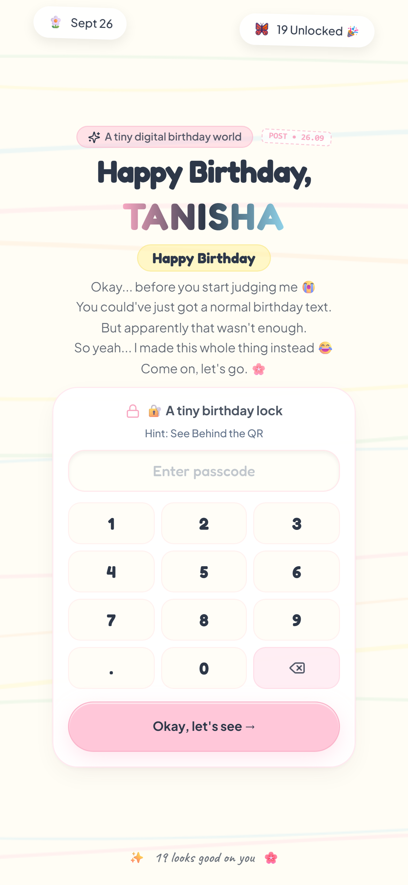
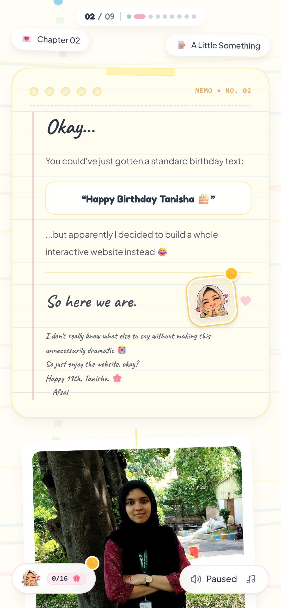
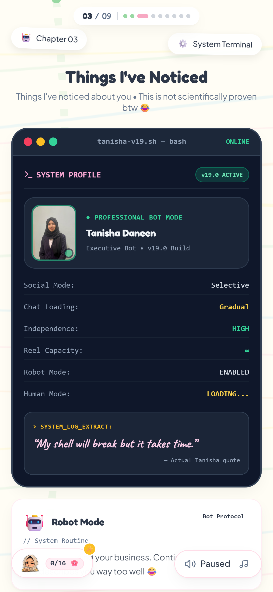
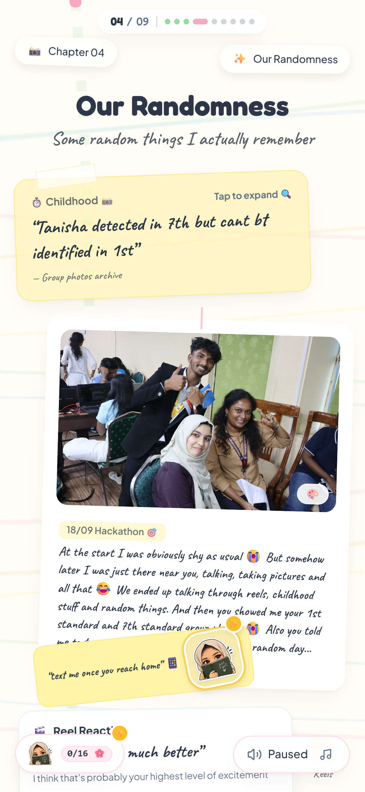
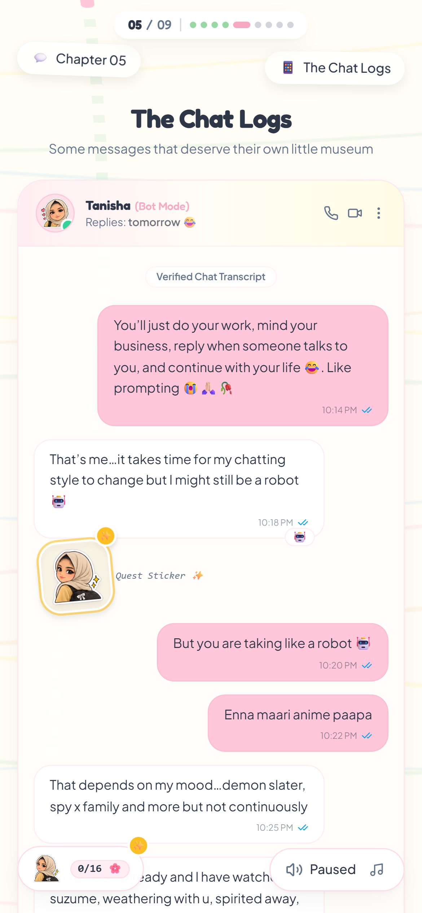
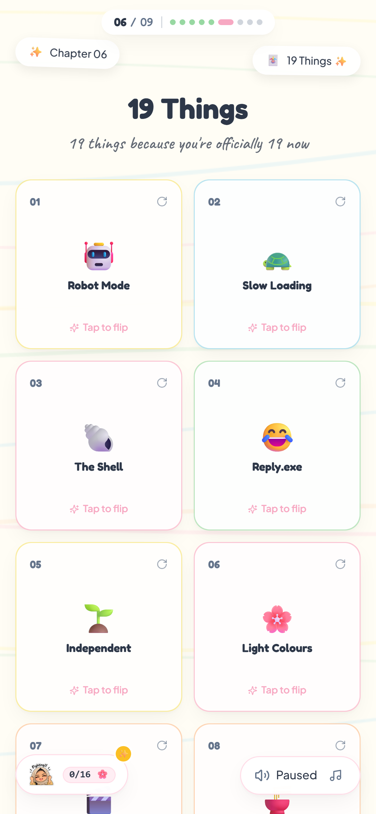
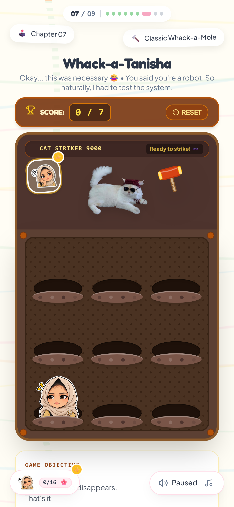
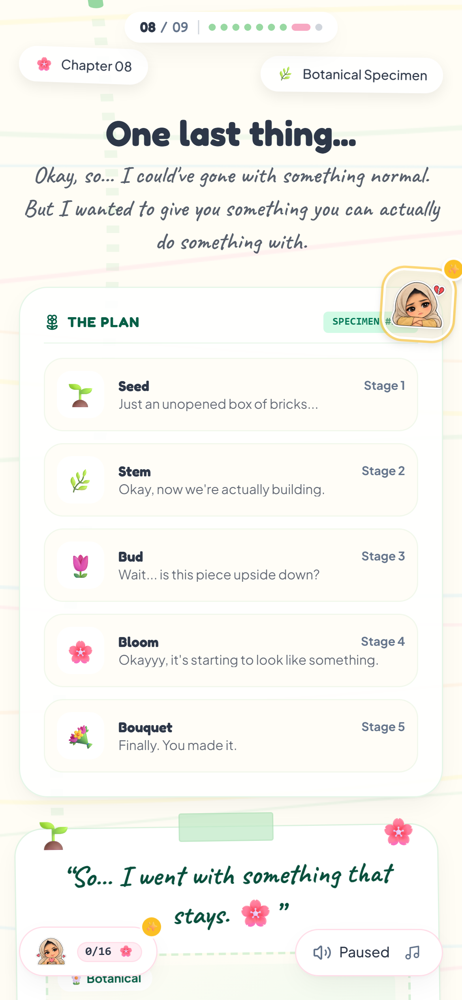
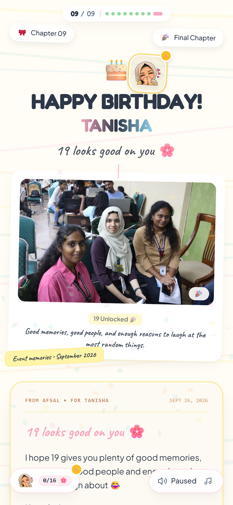
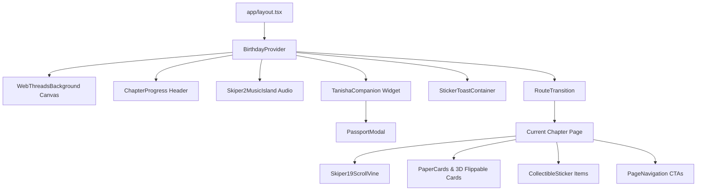

# Tanisha's 19th Birthday 🎂 | 26.09

<div align="center">


<br />

**A mobile-first, 9-chapter interactive digital birthday scrapbook experience built for Tanisha's 19th Birthday (September 26, 2007) by Afsal.**

[Explore Chapters](#-chapter-by-chapter-walkthrough) • [Key Features](#-key-features) • [Getting Started](#-getting-started) • [Architecture](#-architecture--system-design) • [Customization](#-customization-guide) • [Deployment](#-deployment)

</div>

---

## 📖 Overview

**26.09** is an interactive, mobile-first web gift designed to celebrate Tanisha's 19th birthday. Crafted with a warm pastel papercraft scrapbook aesthetic, it blends multi-route storytelling, tactile interactions, hardware-accelerated 3D animations, an arcade mini-game, and genuine college inside jokes into a single coherent journey.

The experience features **9 dedicated chapters**, a **16-sticker scavenger hunt system**, an interactive **Birthday Passport**, simulated **chat logs**, and a **persistent floating music island** that plays smoothly across all route transitions without interruptions.

---

## 📱 Visual Showcase

<div align="center">

| Chapter 01: Birthday Gate | Chapter 02: The Note | Chapter 03: Things I've Noticed |
| :---: | :---: | :---: |
|  |  |  |
| **Passcode 26.09 & Audio Unlock** | **Handwritten Scrapbook Letter** | **Tanisha v19.0 System Profile** |

| Chapter 04: College Memories | Chapter 05: The Chat Logs | Chapter 06: 19 Things Deck |
| :---: | :---: | :---: |
|  |  |  |
| **Polaroids, Tapes & Lightbox** | **Simulated DM & Reply Delays** | **3D Tap-to-Flip Birthday Cards** |

| Chapter 07: Whack-a-Tanisha | Chapter 08: Flower Reveal | Chapter 09: Final Celebration |
| :---: | :---: | :---: |
|  |  |  |
| **Arcade Game & Ezra Reactions** | **939-Piece Wildflower Bouquet** | **Confetti, Letter & Reset** |

</div>

---

## 📑 Table of Contents

1. [Key Features](#-key-features)
2. [Chapter-by-Chapter Walkthrough](#-chapter-by-chapter-walkthrough)
3. [Interactive Systems](#-interactive-systems)
   - [Persistent Audio Island (`Skiper 2`)](#1-persistent-audio-island-skiper-2)
   - [Collectible Sticker Scavenger Hunt](#2-collectible-sticker-scavenger-hunt-16-stickers)
   - [Birthday Passport & Tanisha Companion](#3-birthday-passport--tanisha-companion)
   - [Whack-a-Tanisha Arcade Mini-Game](#4-whack-a-tanisha-arcade-mini-game)
   - [Chat Logs Experience](#5-chat-logs-experience)
4. [Tech Stack](#-tech-stack)
5. [Architecture & System Design](#-architecture--system-design)
   - [Directory Structure](#directory-structure)
   - [Component Hierarchy](#component-hierarchy)
   - [Data Layer Architecture](#data-layer-architecture)
6. [Prerequisites](#-prerequisites)
7. [Getting Started](#-getting-started)
8. [Available Scripts](#-available-scripts)
9. [Visual Regression & Screenshot Testing](#-visual-regression--screenshot-testing)
10. [Customization Guide](#-customization-guide)
11. [Deployment](#-deployment)
12. [Troubleshooting](#-troubleshooting)
13. [License & Credits](#-license--credits)

---

## ✨ Key Features

- 🎂 **9 Dedicated Story Chapters**: From the passcode gate to a 939-piece wildflower build reveal and grand birthday finale.
- 🎵 **Persistent Root Audio (`Skiper 2`)**:
  - Global HTML5 audio engine mounted in Next.js root layout.
  - Zero audio stutters or restarts across page transitions.
  - Floating Dynamic Island widget with animated soundwave visualizer, mute toggles, and volume controls.
- 🏷️ **16-Sticker Scavenger Hunt**:
  - Hidden clickable sticker collectibles tucked into each chapter.
  - Custom Web Audio API synthesized marimba chime sequence on discovery.
  - Real-time toast notifications and sticker completion tracking.
- 🛂 **Birthday Passport Companion**:
  - Floating Tanisha companion avatar with dynamic status alerts (`New Stamp Available`).
  - Slide-up passport booklet modal tracking visits to all 9 chapters.
  - Milestone unlock rewards and chapter fast-travel capabilities.
- 🕹️ **Arcade Mini-Game (`Whack-a-Tanisha`)**:
  - 9-hole mole board with dynamic spawn loops.
  - Mallet strike visual effects, score counter, and celebratory confetti at 10 points.
  - Live reaction commentary from Ezra the cat, complete with "Ezra Rage Mode" on missed clicks.
- 💬 **Interactive Chat Simulator**:
  - Realistic WhatsApp/iMessage mobile mockup capturing Tanisha's signature "Replies in 2–3 business days" dynamic.
  - Floating emoji reaction bar, read receipts, and expandable quotes.
- 🎴 **Hardware-Accelerated 3D Cards**:
  - 19 interactive cards on a 2-column mobile grid.
  - Tap-to-flip CSS 3D transforms with back-face visibility optimization.
- 🌿 **Scroll-Linked SVG Growth (`Skiper 19`)**:
  - Organic winding vine and floral motif that progresses as the user scrolls.
- 📱 **Strict Mobile-First Craft**:
  - Tuned for viewports from $360\text{px}$ to $430\text{px}+$ (iPhone SE to Pro Max & Android).
  - Touch-optimized target bounds ($\ge 44\text{px}$).
  - $0\text{px}$ accidental horizontal overflow with dynamic viewport height (`100dvh`).

---

## 🗺️ Chapter-by-Chapter Walkthrough

| # | Route | Title | Theme & Description |
| :--- | :--- | :--- | :--- |
| **01** | `/` | **Birthday Gate** | Playful 4-digit passcode gate (`26.09`). Features React Bits text looping, interactive Web Threads canvas background, QR hint modal, and touch gesture audio unlocking. |
| **02** | `/note` | **A Little Something** | Textured scrapbook paper letter teasing why this custom site was built over a plain birthday text, accompanied by floating stickers and winding SVG vines. |
| **03** | `/noticed` | **Things I've Noticed** | Tanisha's System Profile terminal card (`v19.0 ACTIVE`), her actual quote (*"My shell will break but it takes time"*), and 6 personality trait observations. |
| **04** | `/memories` | **Our Randomness** | Intentionally chaotic college scrapbook: taped polaroid photos, reel addiction reactions, food debates, the Robot Incident, and tap-to-expand lightbox view. |
| **05** | `/chat` | **The Chat Logs** | Mobile messaging mockup showcasing authentic chat moments, funny excuses, delayed replies, and interactive emoji reactions. |
| **06** | `/nineteen` | **19 Things** | 2-column responsive mobile grid of 19 cards featuring 3D tap-to-flip mechanics, culminating in a full-width reveal for Card 19. |
| **07** | `/game` | **Whack-a-Tanisha** | Fast-paced tap arcade game: strike popping Tanisha moles, avoid misses to keep Ezra the cat calm, hit 10 points to claim the chapter sticker. |
| **08** | `/gift` | **Flower Reveal** | Five-stage botanical growth timeline (Seed 🌱 → Stem 🌿 → Leaf 🌼 → Flower 🌸 → 939-Piece Wildflower Building Bouquet) with humorous patience warnings. |
| **09** | `/birthday` | **Final Celebration** | Pastel confetti bursts, celebratory balloons, Afsal's heartfelt closing friendship letter, music replay, and journey restart controls. |

---

## 🎮 Interactive Systems

### 1. Persistent Audio Island (`Skiper 2`)
Implemented in [`components/audio/Skiper2MusicIsland.tsx`](file:///g:/Projects/Web%20Development/26.09/components/audio/Skiper2MusicIsland.tsx) and mounted directly in the root layout [`app/layout.tsx`](file:///g:/Projects/Web%20Development/26.09/app/layout.tsx).
- Conforms to mobile browser autoplay security policies: initial audio context is primed during the passcode submission gesture on `/`.
- Renders as a floating pill (Dynamic Island style) in the upper-right corner.
- Contains dynamic CSS keyframe soundwave bars (`waveBar`), play/pause controls, and volume state.

### 2. Collectible Sticker Scavenger Hunt (16 Stickers)
Controlled by [`hooks/useStickerCollection.ts`](file:///g:/Projects/Web%20Development/26.09/hooks/useStickerCollection.ts):
- 16 custom illustrated stickers scattered across all 9 routes.
- Clicking any undiscovered sticker triggers:
  1. Synthesized Web Audio API marimba chime (`C6` $\rightarrow$ `G6` $\rightarrow$ `C7`).
  2. Local canvas confetti burst.
  3. Toast notification banner displaying collection progress (e.g., `3 / 16 Stickers Found`).
  4. Instant synchronization to browser `localStorage`.

### 3. Birthday Passport & Tanisha Companion
Managed via [`hooks/usePassport.ts`](file:///g:/Projects/Web%20Development/26.09/hooks/usePassport.ts) and [`components/passport/`](file:///g:/Projects/Web%20Development/26.09/components/passport/):
- The floating companion widget in the lower-left corner tracks the user's journey.
- Automatically awards official passport stamps whenever a new chapter route is reached.
- Tapping opens the interactive **Birthday Passport Booklet Modal**, displaying:
  - Total stamps collected (`01 / 09`).
  - Detailed inspection view for every collected sticker with lore, personality notes, and chapter origin.
  - Direct quick-jump navigation to unlocked chapters.

### 4. Whack-a-Tanisha Arcade Mini-Game
Located at [`app/game/page.tsx`](file:///g:/Projects/Web%20Development/26.09/app/game/page.tsx):
- 9-hole mole field with dynamic timer loops.
- Preloaded graphic assets for instant latency-free rendering on mobile devices.
- **Ezra the Cat Commentary**: Ezra sits at the top watching the game. Tapping empty holes triggers **Ezra Rage Mode** with custom quotes (*"MEOW?! HOW DID YOU MISS THAT?!"*).
- Reaching 10 points unlocks the **Cat Suspicion** secret sticker and fires celebratory confetti.

### 5. Chat Logs Experience
Located at [`app/chat/page.tsx`](file:///g:/Projects/Web%20Development/26.09/app/chat/page.tsx):
- Custom simulated iOS / WhatsApp chat container with sender avatars, online presence dot, and read receipts (`CheckCheck`).
- Interactive emoji reaction pill allowing readers to react with hearts, laughs, and sparkles to chat bubbles in real-time.

---

## 🛠️ Tech Stack

| Domain | Technology | Purpose |
| :--- | :--- | :--- |
| **Framework** | [Next.js 14](https://nextjs.org/) (App Router) | Multi-route architecture, layout persistence, static optimization |
| **UI Library** | [React 18](https://react.dev/) | Core UI rendering and reactive state |
| **Language** | [TypeScript 5](https://www.typescriptlang.org/) | Type-safe data schema, props, and interfaces |
| **Styling** | [Tailwind CSS 3](https://tailwindcss.com/) | Mobile-first utility design with custom pastel tokens |
| **Motion** | [Framer Motion 11](https://www.framer.com/motion/) | Route transitions, 3D card flips, sticker wobbles, modal sheets |
| **Canvas FX** | [Canvas Confetti](https://www.npmjs.com/package/canvas-confetti) | Confetti explosions on milestone completions |
| **Visuals** | React Bits Canvas Mesh | Custom interactive Pastel Web Threads background |
| **Icons** | [Lucide React](https://lucide.dev/) | Clean, accessible vector UI icons |
| **Testing** | [Playwright](https://playwright.dev/) | Mobile device viewport emulation & automated screenshot capture |

---

## 🏗️ Architecture & System Design

### Directory Structure

```text
26.09/
├── app/                              # Next.js 14 App Router
│   ├── layout.tsx                    # Root Layout (Audio Island, Passport, Progress, Background)
│   ├── globals.css                   # Global styles, Tailwind directives, 3D perspective
│   ├── page.tsx                      # Chapter 01: Birthday Gate (/)
│   ├── note/page.tsx                 # Chapter 02: The Note (/note)
│   ├── noticed/page.tsx              # Chapter 03: Things I've Noticed (/noticed)
│   ├── memories/page.tsx             # Chapter 04: Our Randomness (/memories)
│   ├── chat/page.tsx                 # Chapter 05: The Chat Logs (/chat)
│   ├── nineteen/page.tsx             # Chapter 06: 19 Things Deck (/nineteen)
│   ├── game/page.tsx                 # Chapter 07: Whack-a-Tanisha (/game)
│   ├── gift/page.tsx                 # Chapter 08: Flower Reveal (/gift)
│   └── birthday/page.tsx             # Chapter 09: Final Celebration (/birthday)
├── components/
│   ├── audio/
│   │   └── Skiper2MusicIsland.tsx    # Persistent root audio controller & soundwave
│   ├── canvas/
│   │   └── WebThreadsBackground.tsx  # Interactive pastel mesh canvas
│   ├── layout/
│   │   ├── ChapterProgress.tsx       # Floating header navigation bar (01/09)
│   │   ├── PageNavigation.tsx        # Next / Prev CTA buttons with specular highlights
│   │   ├── PageTransition.tsx        # Scrapbook paper-turn transition wrapper
│   │   └── RouteTransition.tsx       # Page transition orchestrator
│   ├── passport/
│   │   ├── PassportModal.tsx         # Full-screen passport booklet dialog
│   │   ├── PassportStampSlot.tsx     # Animated chapter stamp display
│   │   └── TanishaCompanion.tsx      # Floating bottom-left companion widget
│   ├── providers/
│   │   └── BirthdayProvider.tsx      # Central audio, unlock state, & route context
│   ├── stickers/
│   │   ├── CollectibleSticker.tsx    # Scavenger hunt sticker component
│   │   ├── StickerMissionModal.tsx   # Sticker collection checklist modal
│   │   └── StickerToastContainer.tsx # Real-time chime & toast manager
│   ├── svg/
│   │   └── Skiper19ScrollVine.tsx    # Scroll-driven decorative SVG vine
│   └── ui/
│       ├── Lightbox.tsx              # Full-screen polaroid image preview modal
│       ├── PaperCard.tsx             # Scrapbook paper textured card container
│       ├── PhotoCard.tsx             # Polaroid frame with washi tape decals
│       ├── SpecularButton.tsx        # Tactile buttons with dynamic specular sweep
│       ├── Sticker.tsx               # Wiggle/floating decorative decals
│       └── TextLoop.tsx              # React Bits cycling hero typography
├── data/
│   └── appData.json                  # Unified data file (copy, jokes, stickers, routes)
├── hooks/
│   ├── usePassport.ts                # Passport stamps & route visit tracker
│   └── useStickerCollection.ts       # 16-sticker inventory & Web Audio chimes
├── lib/
│   ├── appData.ts                    # Strongly-typed data accessor exports
│   └── utils.ts                      # Tailwind cn class merger
├── public/
│   └── assets/
│       ├── flowers/                  # Botanical growth SVGs
│       ├── gift/                     # Wildflower bouquet illustrations
│       ├── music/                    # Background MP3 audio track
│       ├── photos/                   # Polaroid photographs & event images
│       ├── stickers/                 # 16 Illustrated Tanisha expressions
│       └── whack_a_mole/             # Game sprites (Ezra, mallets, moles)
├── screenshots/                      # High-resolution mobile device screenshots
├── scripts/
│   ├── capture_all_screenshots.mjs   # Playwright automation script (iPhone 12 @ 3x DPR)
│   └── generate_favicon.py           # Favicon & touch icon generator
├── tailwind.config.ts                # Custom pastel palette & keyframe animations
└── tsconfig.json                     # TypeScript compiler configuration
```

### Component Hierarchy



### Data Layer Architecture

All textual content, quotes, sticker metadata, game parameters, and chapter definitions are decoupled into [`data/appData.json`](file:///g:/Projects/Web%20Development/26.09/data/appData.json) and typed through [`lib/appData.ts`](file:///g:/Projects/Web%20Development/26.09/lib/appData.ts):

- **Zero hardcoded JSX text**: Modify any inside joke, title, or message in one place without touching layout code.
- **Fail-safe image fallbacks**: When custom photos are not provided in `public/assets/photos/`, the UI automatically renders handcrafted botanical and character SVG illustrations.

---

## 📋 Prerequisites

Before starting, ensure you have the following installed on your system:

- **Node.js**: Version `18.17.0` or higher (`20.x` LTS recommended).
- **npm** (`v9+`), **pnpm** (`v8+`), or **yarn**.
- A modern web browser (Google Chrome, Safari, or Edge) with DevTools device emulation.

To check your Node version:
```bash
node -v
# Should output v18.17.0 or higher
```

---

## 🚀 Getting Started

### 1. Clone the Repository
```bash
git clone https://github.com/kittyboy06/26.09.git
cd 26.09
```

### 2. Install Dependencies
```bash
npm install
# or if using pnpm:
# pnpm install
```

### 3. Start the Development Server
```bash
npm run dev
```

Open [http://localhost:3000](http://localhost:3000) in your browser.

> [!TIP]
> **Mobile Emulation Recommended**:
> For the intended experience, open Chrome DevTools (<kbd>F12</kbd> or <kbd>Cmd+Option+I</kbd>), toggle the Device Toolbar (<kbd>Ctrl+Shift+M</kbd> or <kbd>Cmd+Shift+M</kbd>), and select an **iPhone 12/13/14**, **iPhone SE**, or **Pixel 7** preset.

### 4. Experience the Journey
1. Enter the passcode: `26.09`.
2. Tap **Unlock Experience** to initialize the ambient music.
3. Journey through the chapters using the bottom navigation buttons or the top chapter progress bar.
4. Keep an eye out for floating stickers to complete your **Birthday Passport**!

---

## 📜 Available Scripts

| Command | Purpose |
| :--- | :--- |
| `npm run dev` | Starts the Next.js development server at `localhost:3000` with hot-reloading. |
| `npm run build` | Compiles an optimized, type-checked production build into `.next/`. |
| `npm run start` | Runs the compiled production server locally. |
| `node scripts/capture_all_screenshots.mjs` | Automates Playwright to capture high-DPR mobile screenshots across all 9 chapters. |

---

## 📸 Visual Regression & Screenshot Testing

The repository includes a Playwright automation script ([`scripts/capture_all_screenshots.mjs`](file:///g:/Projects/Web%20Development/26.09/scripts/capture_all_screenshots.mjs)) that emulates an **iPhone 12** ($390\text{px} \times 844\text{px}$ at $3\times$ DPR = $1170\text{px} \times 2532\text{px}$ physical resolution).

To generate or refresh all 9 chapter screenshots:

```bash
# 1. Start the local server in one terminal
npm run dev

# 2. In another terminal, run the Playwright capture script
node scripts/capture_all_screenshots.mjs
```

The script automatically:
- Injects session credentials to unlock gated routes.
- Waits for Google Web Fonts (`Fredoka`, `Caveat`, `Plus Jakarta Sans`) to load.
- Triggers smooth scrolls to preload lazy-loaded images.
- Produces both standard viewport snapshots and full-length scrapbook captures in `/screenshots/`.

---

## 🎨 Customization Guide

You can easily adapt this project for another person or anniversary:

### 1. Modifying Recipient & Passcode
Open [`data/appData.json`](file:///g:/Projects/Web%20Development/26.09/data/appData.json) and edit the `site` block:

```json
"site": {
  "recipient": "Tanisha",
  "creator": "Afsal",
  "age": 19,
  "birthDate": "September 26, 2007",
  "passcode": "26.09",
  "passcodeHint": "See Behind the QR",
  "audioTrack": "/assets/music/birthday.mp3"
}
```

### 2. Updating Personal Memories & Quotes
In [`data/appData.json`](file:///g:/Projects/Web%20Development/26.09/data/appData.json):
- `screens.noticed.cards`: Update the 6 personality cards and traits.
- `screens.memories.items`: Add or edit scrapbook polaroid cards and captions.
- `screens.chat.messages`: Add custom chat interactions and inside jokes.
- `screens.nineteen.items`: Change the 19 cards in the 3D deck.

### 3. Replacing Photos & Music
- **Photos**: Place image files into [`public/assets/photos/`](file:///g:/Projects/Web%20Development/26.09/public/assets/photos/) and update the corresponding `src` properties in `data/appData.json`.
- **Music**: Place any `.mp3` file into [`public/assets/music/`](file:///g:/Projects/Web%20Development/26.09/public/assets/music/) and reference it under `site.audioTrack`.

---

## 🚢 Deployment

### Deploying to Vercel (Recommended)

Next.js App Router applications are optimized for deployment on [Vercel](https://vercel.com):

1. Push your repository to GitHub.
2. Go to [Vercel Dashboard](https://vercel.com/new) and import the repository.
3. Keep the default build settings (`next build`, output directory `.next`).
4. Click **Deploy**.

Alternatively, deploy via the Vercel CLI:
```bash
npm i -g vercel
vercel
```

### Docker Deployment

To run in a containerized environment, create a `Dockerfile`:

```dockerfile
FROM node:20-alpine AS builder
WORKDIR /app
COPY package*.json ./
RUN npm ci
COPY . .
RUN npm run build

FROM node:20-alpine AS runner
WORKDIR /app
ENV NODE_ENV=production
COPY --from=builder /app/public ./public
COPY --from=builder /app/.next/standalone ./
COPY --from=builder /app/.next/static ./.next/static

EXPOSE 3000
ENV PORT=3000
CMD ["node", "server.js"]
```

Build and run:
```bash
docker build -t tanisha-birthday .
docker run -p 3000:3000 tanisha-birthday
```

---

## 🔧 Troubleshooting

### Audio Does Not Autoplay
- **Cause**: Modern mobile browsers (iOS Safari, Android Chrome) block programmatic audio playback without a direct user gesture.
- **Solution**: Audio playback is specifically tied to the passcode submission tap on the entrance gate (`/`). If opening directly to an internal route, users can tap the floating music island pill in the upper-right corner to start playback.

### Passport Stamps Not Saving
- **Cause**: Private/Incognito browsing modes occasionally restrict `localStorage` writes.
- **Solution**: The application includes safe fallback exception handling so the app remains fully navigable even when `localStorage` is disabled.

### Mobile Viewport Height Jitter
- **Cause**: Mobile browser address bars expanding/collapsing when scrolling can cause `100vh` layout shifts.
- **Solution**: All root layout containers use CSS `min-h-[100dvh]` (Dynamic Viewport Height) with `overflow-x-hidden` to ensure zero jitter and no horizontal drift.

---

## 📄 License & Credits

- **Creator**: [Afsal](https://github.com/kittyboy06)
- **Recipient**: Tanisha
- **Fonts Used**:
  - `Fredoka` & `Quicksand` (Display headers)
  - `Caveat` (Handwritten scrapbook accents)
  - `Plus Jakarta Sans` (Body text)
- **License**: Released under the [MIT License](LICENSE) for educational and personal use. Feel free to fork and build something memorable for your friends!
